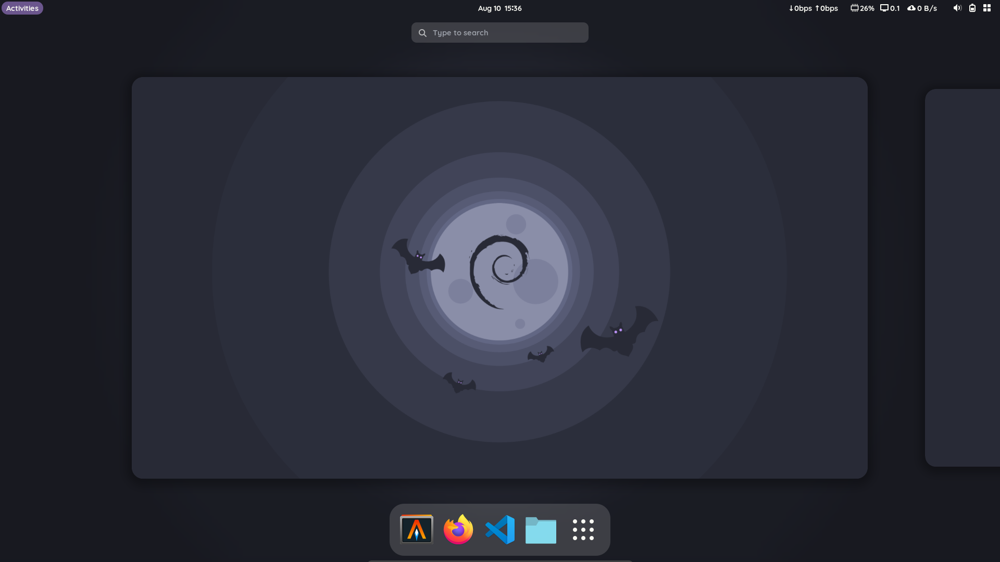
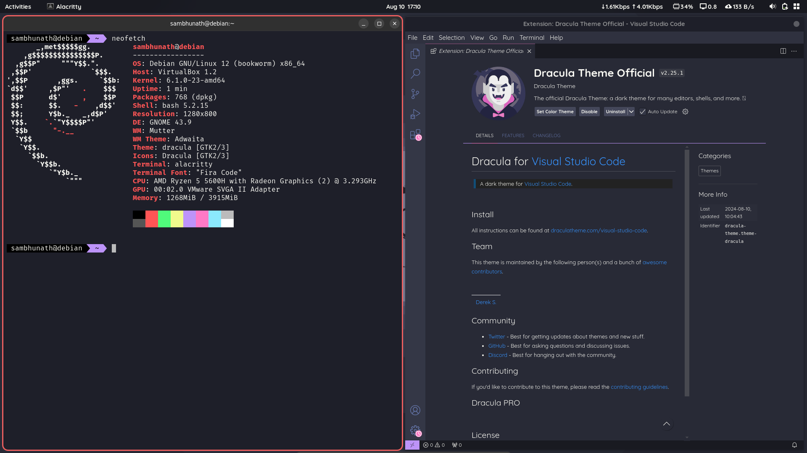

# Arch Ricing Recipe
This is a recipe to setup my gnome desktop environment from scratch with minimum bloat and an optional theme.
In a fresh arch installation install git and clone this repository. Then run install-gnome script

```
sudo pacman -S git
git clone https://github.com/MarkWolf257/arch-ricing-recipes.git
cd arch-ricing-recipes
./install-gnome
```

<br />

## Packages to install
- web browser
- file manager
- code editor

## Configuration Resources (Irrelevant screenshots follow)





- starship prompt - https://github.com/starship/starship
- gtk themes - https://github.com/vinceliuice/Colloid-gtk-theme
- terminal colorschemes - https://github.com/mbadolato/iTerm2-Color-Schemes
- neovim distro (requires latest version nvim) - https://github.com/NvChad/NvChad
